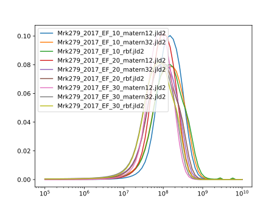
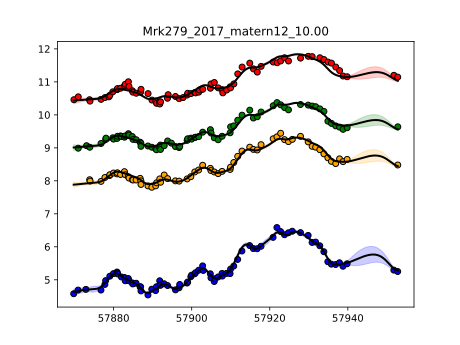

# Mrk279_2017

Transfer functions given by physical model.

Code and results for experiment [here](Mrk279_2017/Experiment1/).

## Mass posteriors per model

## Posterior distribution of models

| Model filename                | posterior prob     |
|-------------------------------|--------------------|
|Mrk279_2017_EF_10_matern12.jld2|	0.14439803610186483|
|Mrk279_2017_EF_10_matern32.jld2|	0.14188410286713005|
|Mrk279_2017_EF_10_rbf.jld2	    |0.11736736632317642|
|Mrk279_2017_EF_20_matern12.jld2|	0.08783612263735091|
|Mrk279_2017_EF_20_matern32.jld2|	0.09313889615791883|
|Mrk279_2017_EF_20_rbf.jld2	    |0.0799273572339405|
|Mrk279_2017_EF_30_matern12.jld2|	0.11948535096465485|
|Mrk279_2017_EF_30_matern32.jld2|	0.11336781504208751|
|Mrk279_2017_EF_30_rbf.jld2|	0.10259495267187635|

### Fit for most likely model Mrk279_2017_EF_10_matern12.jld2

