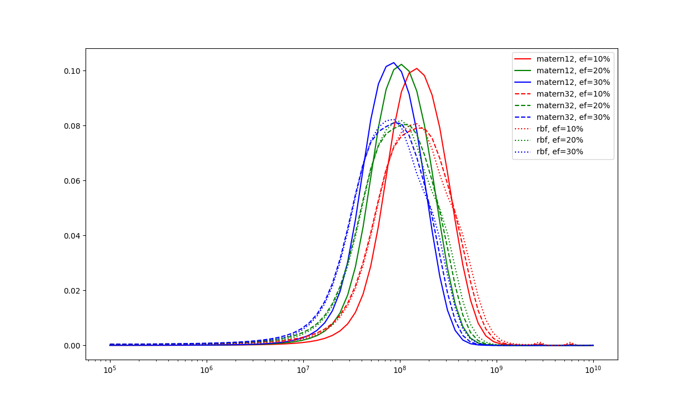
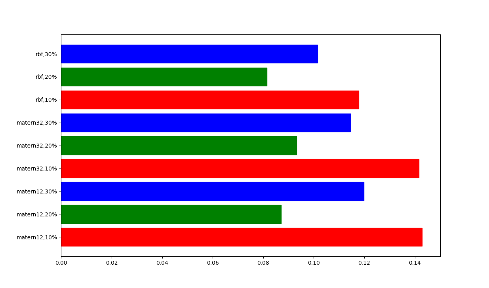
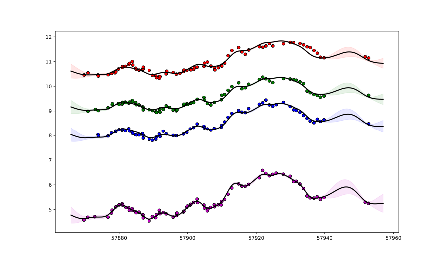
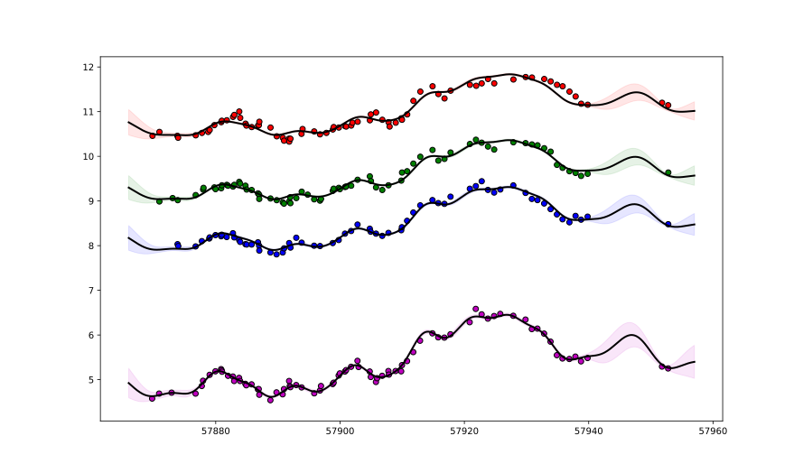

# Mrk279_2017

Transfer functions given by physical model.

Code and results for experiment [here](ConvolvedGaussianProcessesExperiments/Mrk279_2017/Experiment1/).

## Mass posteriors per model

## Posterior distribution of models

| Model filename                | posterior prob     |
|-------------------------------|--------------------|

### Fit for most likely model Mrk509_2016_EF_10_matern32.jld2

### Joint probability for kernel, eddington fraction

| Kernel | Eddignton fraction | posterior probability |
| --- | --- | --- |
| matern12 | 10% | 0.14 |
| matern12 | 20% | 0.09 |
| matern12 | 30% | 0.12 |
| matern32 | 10% | 0.14 |
| matern32 | 20% | 0.09 |
| matern32 | 30% | 0.11 |
| rbf | 10% | 0.12 |
| rbf | 20% | 0.08 |
| rbf | 30% | 0.10 |

### Fitted lightcurves for Matern12, 10%
For the combination matern12 and 10%, the most likely mass is 1.494869e+08.
We plot the uncertainty tube for 1 standard deviation.

### Fitted lightcurves for rbf, 20%
For the combinarion rbf and 20%, the most likely mass is 1.037225e+08.
We plot the uncertainty tube for 1 standard deviation.

