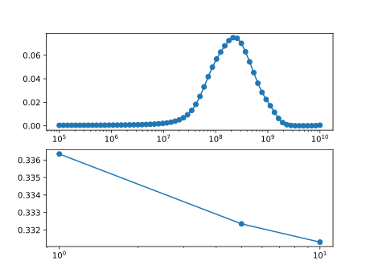
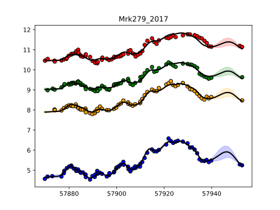

# Mrk279_2017

Transfer functions given by physical model.

Code and results for experiment [here](Real/Mrk279_2017/Experiment1/).

## Mass and EF posterior

### Fit for most likely model Mrk279_2017_EF_10_matern12.jld2

