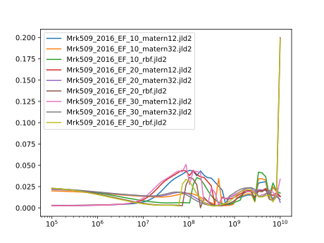
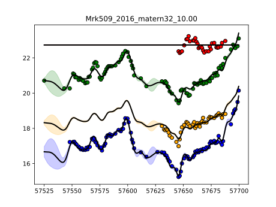

# Mrk509_2016

Transfer functions given by physical model.

Code and results for experiment [here](Mrk509/2016/Experiment1/).

## Mass posteriors per model

## Posterior distribution of models

| Model filename                | posterior prob     |
|-------------------------------|--------------------|
|Mrk509_2016_EF_10_matern12.jld2|	0.0782539544248696 |
|Mrk509_2016_EF_10_matern32.jld2|	0.19741533730525948|
|Mrk509_2016_EF_10_rbf.jld2	    |0.06740485902016966 | 
|Mrk509_2016_EF_20_matern12.jld2|	0.06030957357640495|
|Mrk509_2016_EF_20_matern32.jld2|	0.18452795693955382|
|Mrk509_2016_EF_20_rbf.jld2	    |0.06710238415194675 |
|Mrk509_2016_EF_30_matern12.jld2|	0.06783336632328572|
|Mrk509_2016_EF_30_matern32.jld2|	0.19553755152807137|
|Mrk509_2016_EF_30_rbf.jld2	    |0.08161501673043872 |

### Fit for most likely model Mrk509_2016_EF_10_matern32.jld2

