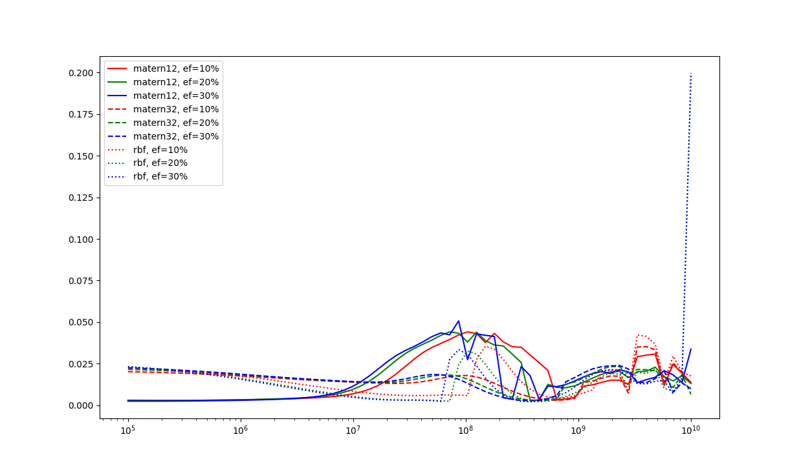
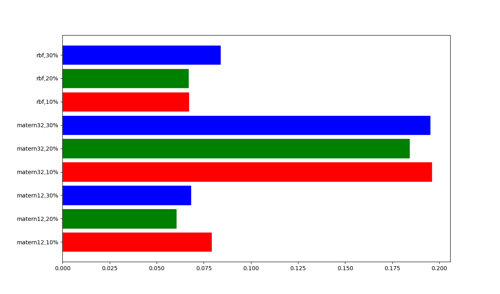
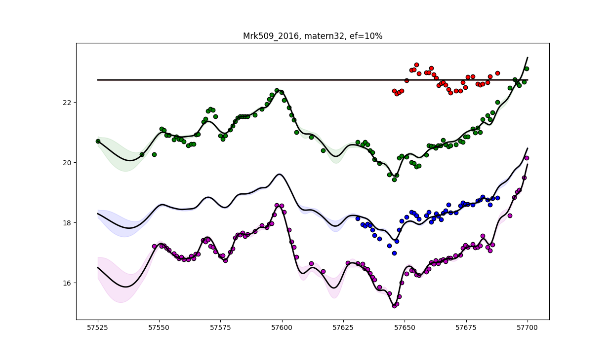
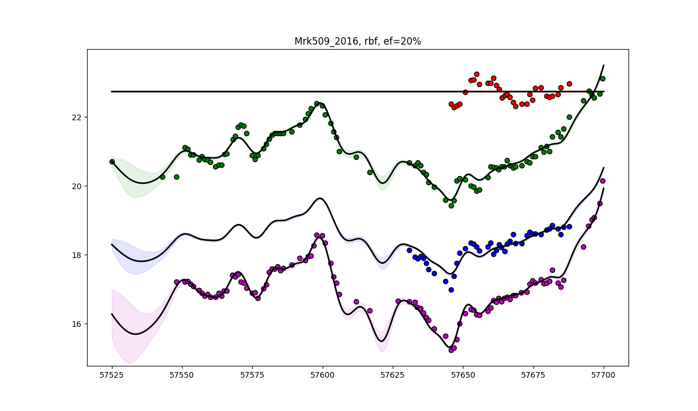

# Mrk509_2016

### Fitted lightcurves for Matern32, 10%

### Fitted lightcurves for rbf, 20%

We see that the top lightcurve cannot be fitted by our model; it chooses to set the scale parameter for this lightcurve equal to 0. Our tentative explanation is that this lightcurve cannot be explained by the transfer function. Maybe we should exclude wavelengths that we know may be well modelled by the transfer function?
