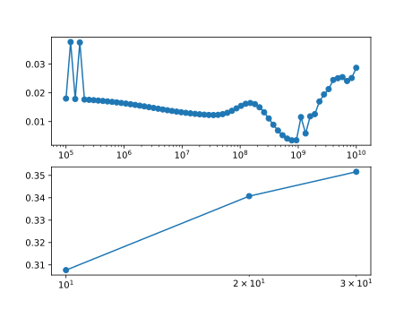

# Mrk509_2016

Transfer functions given by physical model.

Code and results for experiment [here](Real/Mrk509/2016/).

## Mass and EF posterior

### Fit for most likely model Mrk509_2016_EF_10_matern32.jld2

