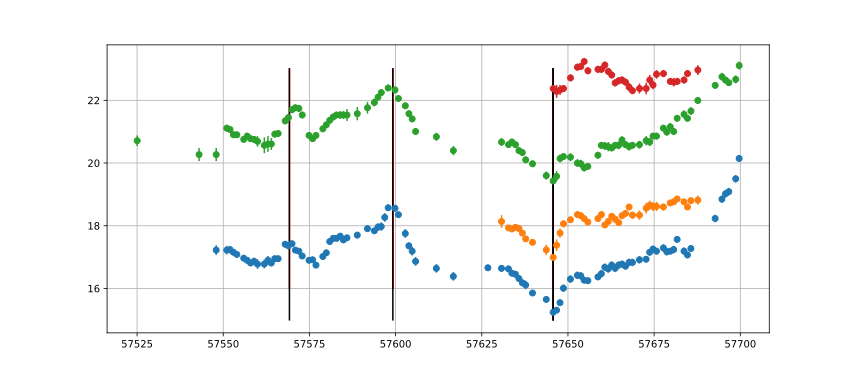

# Mrk509_2016

Transfer functions given by physical model.

Code and results for experiment [here](Real/Mrk509/2016/).

## Mass and EF posterior

## Most likely fit

## What is going on?

### Visual inspection of delays

We look at particular time instances to visually inspect the presence of delays.

### Explanation of flat line

The red light curve seems to exhibit behaviour that looks different compared to the behaviour of the other lightcurves.
The model cannot simulateneously explain well the behaviour of all lightcurves as the convolution of transfer functions with a *common* latent signal.
In this particular case, it seems that the model prefers to set the scaling coefficient of the problematic lightcurve very close to zero.
Consequently it produces a flat line as a fit for the problematic lightcurve.
This seems preferable to the model as it now can focus on modelling the other lightcurves; whatever latent signal it chooses in order to explain the other lightcurves, the fit for the problematic lighcurve is always a flat line since its scaling coefficient is very close to zero.

We investigate this issue with simulations [here](Synthetic2.md) and [here](Synthetic3.md).
