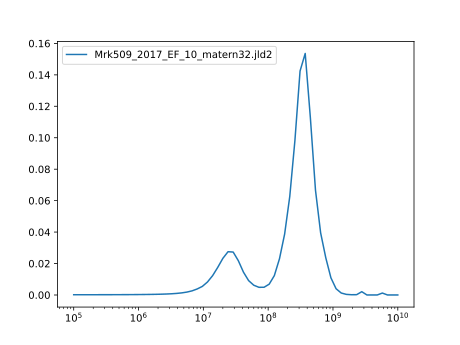
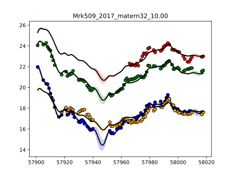

# Mrk509_2017

Transfer functions given by physical model.

Code and results for experiment [here](Mrk509/2017/Experiment1/).

We run only one model namely: kernel=matern32, EF=10.

## Mass posterior

## Fit

