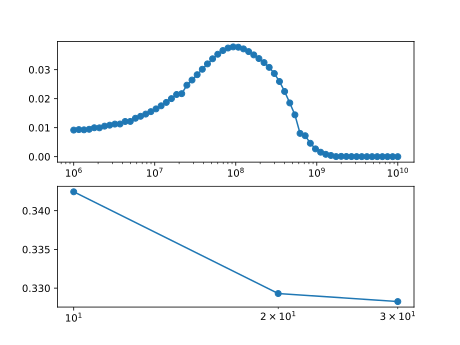
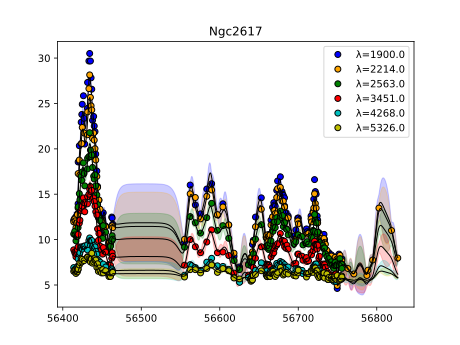

# Ngc2617

Transfer functions given by physical model.

The very first wavelength is discarded in this experiment.

Code and results for experiment [here](Real/Ngc2617/).

## Mass and EF posterior

## Most likely fit

