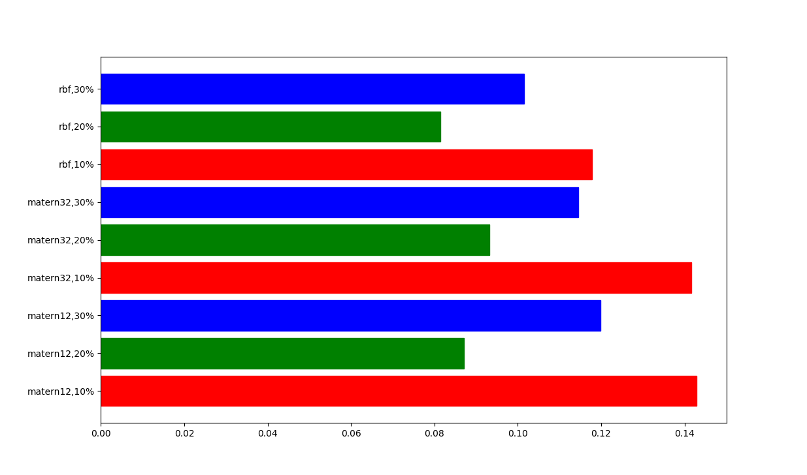

# ConvolvedGaussianProcessesExperiments

## Mrk279_2019

### Joint probability for kernel, eddington fraction

| Kernel | Eddignton fraction | posterior probability |
| --- | --- | --- |
| matern12 | 10% | 0.14 |
| matern12 | 20% | 0.09 |
| matern12 | 30% | 0.12 |
| matern32 | 10% | 0.14 |
| matern32 | 20% | 0.09 |
| matern32 | 30% | 0.11 |
| rbf | 10% | 0.12 |
| rbf | 20% | 0.08 |
| rbf | 30% | 0.10 |

### Marginal probability for kernel

| Kernel  | posterior probability |
| --- | --- |
| matern12 | 0.35 |
| matern32 | 0.34 |
| rbf |  0.30 |
