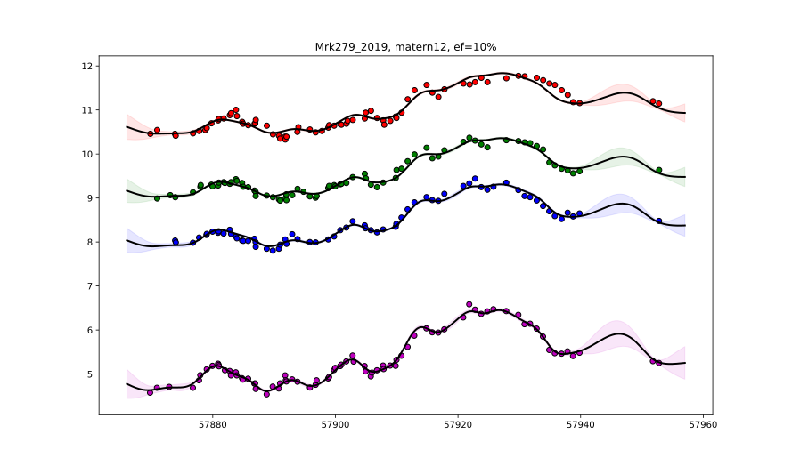
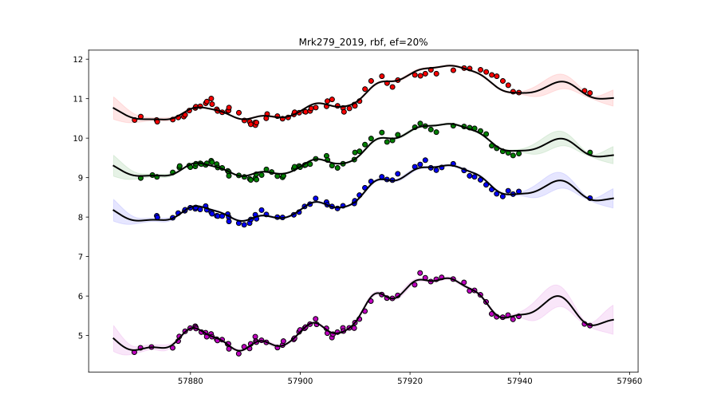

# ConvolvedGaussianProcessesExperiments

## Mrk279_2019

### Joint probability for kernel, eddington fraction

| Kernel | Eddignton fraction | posterior probability |
| --- | --- | --- |
| matern12 | 10% | 0.14 |
| matern12 | 20% | 0.09 |
| matern12 | 30% | 0.12 |
| matern32 | 10% | 0.14 |
| matern32 | 20% | 0.09 |
| matern32 | 30% | 0.11 |
| rbf | 10% | 0.12 |
| rbf | 20% | 0.08 |
| rbf | 30% | 0.10 |

### Marginal probability for kernel

| Kernel  | posterior probability |
| --- | --- |
| matern12 | 0.35 |
| matern32 | 0.34 |
| rbf |  0.30 |

### Marginal probability for eddington fraction

| Eddington fraction  | posterior probability |
| --- | --- |
| 10% | 0.40 |
| 20% | 0.26 |
| 30% | 0.33 |

### Fitted lightcurves for Matern12, 10%
For the combination matern12 and 10%, the most likely mass is 1.494869e+08.

### Fitted lightcurves for rbf, 20%
For the combinarion rbf and 20%, the most likely mass is 1.037225e+08.

