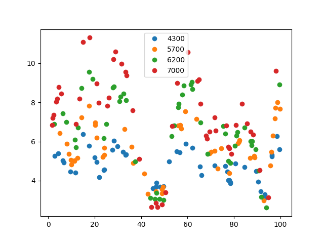
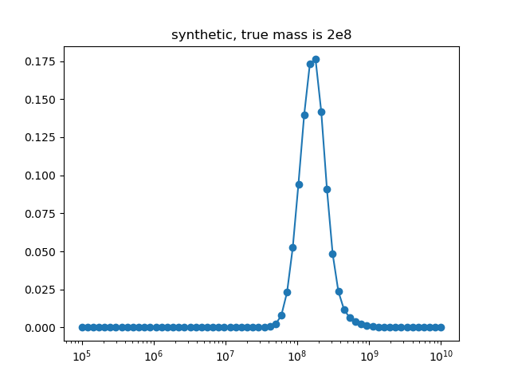

## Synthetic, 1

This experiment is coded in this [folder](Synthetics/Experiment2/).

The purpose of this numerical experiment is to verify that our code can correctly recover the mass parameter.

This is a figure of the synthetically generated light curves (on averate there is one observation per unit time):

This is the inferred posterior mass:

This is the fit for the most likely mass:

