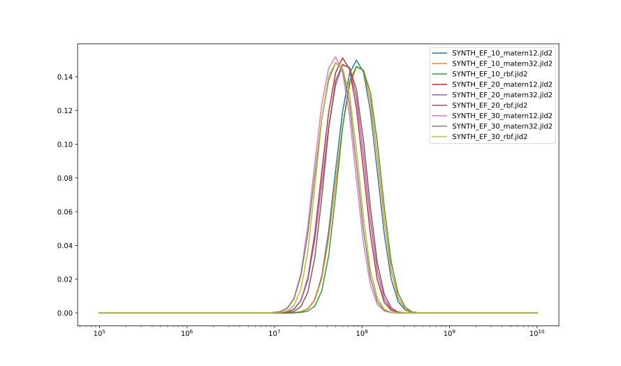
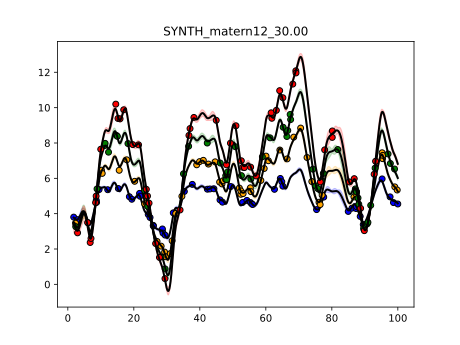

## Synthetic, 1

This experiment is coded in this [folder](Synthetics/Experiment1/).

The purpose of this numerical experiment is to verify that our code can correctly recover the mass parameter.

## Mass posteriors per model

## Posterior distribution of models

| Model filename                | posterior prob     |
|-------------------------------|--------------------|
|SYNTH_EF_10_matern12.jld2|	0.13858197141729048|
|SYNTH_EF_10_matern32.jld2|	0.12500915023423442|
|SYNTH_EF_10_rbf.jld2|	0.08916962695430516|
|SYNTH_EF_20_matern12.jld2|	0.10271267099088463|
|SYNTH_EF_20_matern32.jld2|	0.09317086240718137|
|SYNTH_EF_20_rbf.jld2|	0.04786202719253639|
|SYNTH_EF_30_matern12.jld2|	0.16209747350851098|
|SYNTH_EF_30_matern32.jld2|	0.15648791112899615|
|SYNTH_EF_30_rbf.jld2|	0.08490830616606056|

### Fit for most likely model SYNTH_EF_30_matern12.jld2

