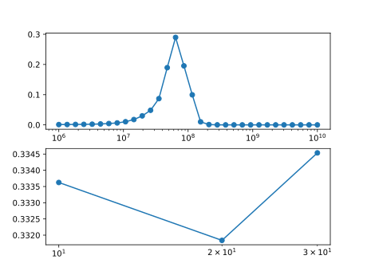
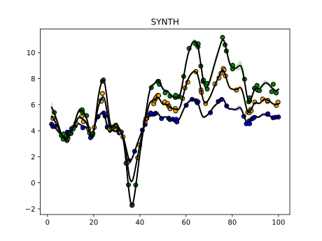

# Synthetic 1

The purpose of this script is just to verify that we can indeed recover the physical parameters (mass and edfraction) in the case of synthetic data where we use the same model to generate and fit the simulated observations.

Code and results for experiment [here](Synthetics/Experiment1Box/).

## Mass and EF posterior

## Most likely fit

