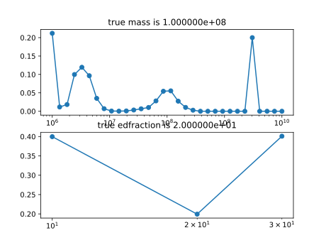
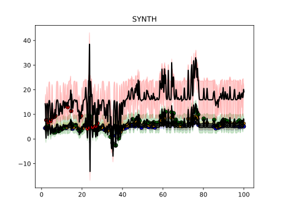

# Synthetic 2

The purpose of this script is to investigate how the model will behave when one of the lightcurves in the dataset bears no connection to the other lightcurves, i.e. the lightcurve in question does not come from the same latent signal as the others.
However, the incongruous lightcurve has been assigned fewer observations than the others (in order to resemble the MRK509_2016 case).
Our expectation is that the model should set the scaling coefficient of the lightcurve in question to zero and still recover the correct parameters.

In this simulation, it is the fourth lightcurve that does not belong.

Code and results for experiment [here](Synthetics/Experiment2/).

## Mass and EF posterior

## Most likely fit

## Why the simulation does not meet our expectation

Although we have setup this simulation to resemble the situation in MRK509_2016 (where the last lightcurve has its scale set to 0),
this does not happen here, i.e. the fit for the problematic lightcurve is not a flat line. The reason seems to be the fact that the variance of the incongruous lightcurve is significant and hence a flat line is not good enough to describe it. We have setup a new experiment [here](Synthetics3.md) that sets variance of the incongruous lightcurve to a lower value.
