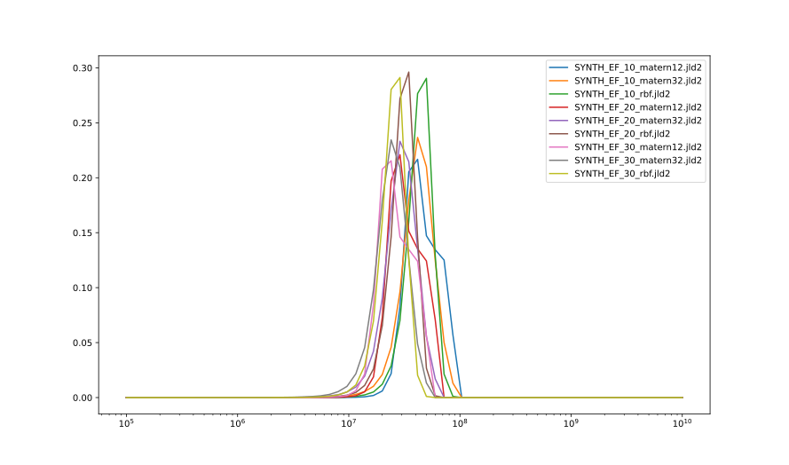
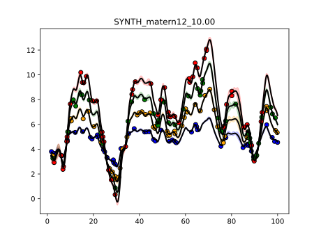

## Synthetic, 2

This experiment is coded in this [folder](Synthetics/Experiment2/).

The purpose of this numerical experiment is to verify that our code can correctly recover the mass parameter.

## Mass posteriors per model

## Posterior distribution of models

| Model filename                | posterior prob     |
|-------------------------------|--------------------|
|SYNTH_EF_10_matern12.jld2|	0.19046333645532249|
|SYNTH_EF_10_matern32.jld2|	0.14144351514903578|
|SYNTH_EF_10_rbf.jld2|	0.021223201186165|
|SYNTH_EF_20_matern12.jld2|	0.1387194419685866|
|SYNTH_EF_20_matern32.jld2|	0.13327468219694502|
|SYNTH_EF_20_rbf.jld2|	0.026637116893282558|
|SYNTH_EF_30_matern12.jld2|	0.14659602206095299|
|SYNTH_EF_30_matern32.jld2|	0.15844574249516816|
|SYNTH_EF_30_rbf.jld2|	0.04319694159454133|

### Fit for most likely model SYNTH_EF_10_matern12.jld2

