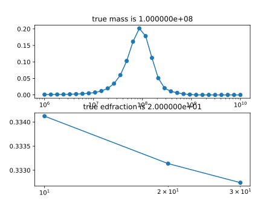
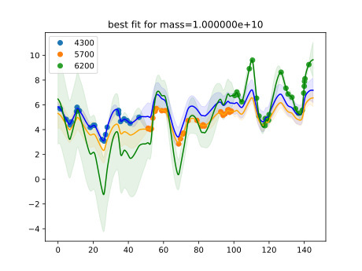

# Synthetic 3

The purpose of this script is to investigate how the model will behave when one of the lightcurves in the dataset bears no connection to the other lightcurves, i.e. the lightcurve in question does not come from the same latent signal as the others.
However, the incongruous lightcurve has been assigned fewer observations than the others (in order to resemble the MRK509_2016 case).
Our expectation is that the model should set the scaling coefficient of the lightcurve in question to zero and still recover the correct parameters.

In this simulation, it is the fourth lightcurve that does not belong.

This simulation is very similar to this [one](Synthetic2.md), the difference being that here we make the variance of the incongruous lightcurve smaller.

Code and results for experiment [here](Synthetics/Experiment3/).

## Mass and EF posterior

## Most likely fit

