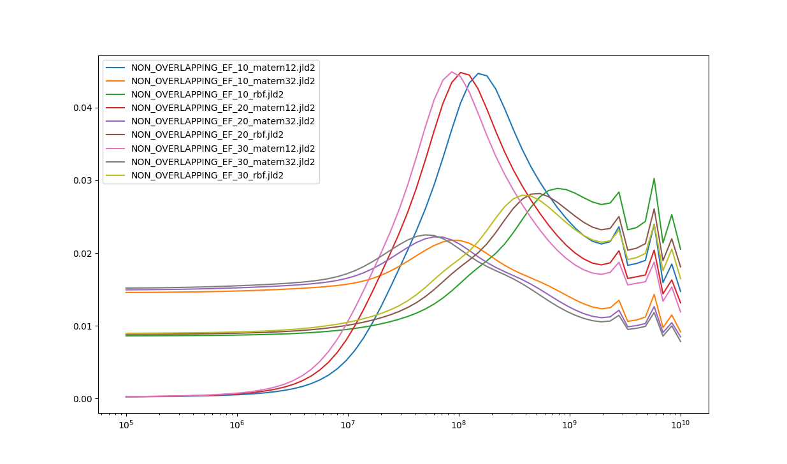
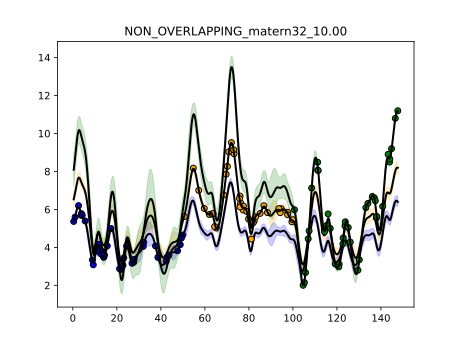

# Synthetic non-overlapping light curves, 1

This experiment is coded in this [folder](Synthetics/Experiment3/).

The purpose of this numerical experiment is to see whether it is theoretically possible to recover the mass parameter for a set of lightcurves that do not overlap in time.

## Mass posteriors per model 

| Model filename                | posterior prob     |
|-------------------------------|--------------------|
|NON_OVERLAPPING_EF_10_matern12.jld2|	0.07685471112115058|
|NON_OVERLAPPING_EF_10_matern32.jld2|	0.16154106671452878|
|NON_OVERLAPPING_EF_10_rbf.jld2	|0.10222558401975139|
|NON_OVERLAPPING_EF_20_matern12.jld2|	0.07543377740840909|
|NON_OVERLAPPING_EF_20_matern32.jld2|	0.1567931973760069|
|NON_OVERLAPPING_EF_20_rbf.jld2|	0.0987351390586257|
|NON_OVERLAPPING_EF_30_matern12.jld2|	0.07594186939233341|
|NON_OVERLAPPING_EF_30_matern32.jld2|	0.1549285448483831|
|NON_OVERLAPPING_EF_30_rbf.jld2|	0.0975461100608111|

This is the fit for the most likely mass:

