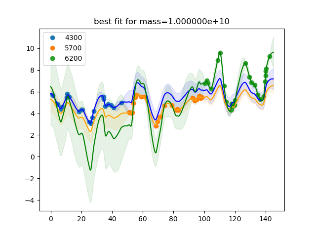

# Synthetic non-overlapping light curves, 1

This experiment is coded in this [folder](Synthetics/Experiment3/).

The purpose of this numerical experiment is to see whether it is theoretically possible to recover the mass parameter for a set of lightcurves that do not overlap in time.

## Mass posteriors per model 

This is the fit for the most likely mass:

