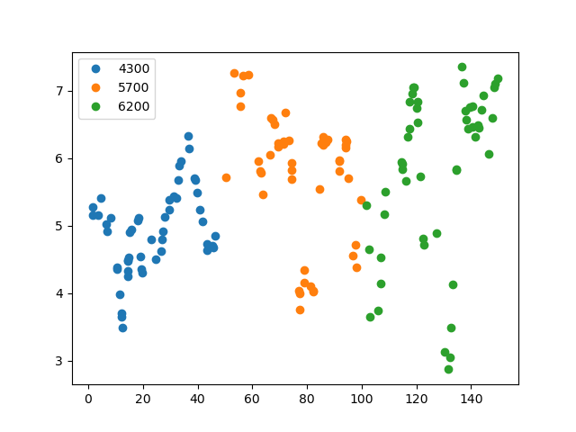
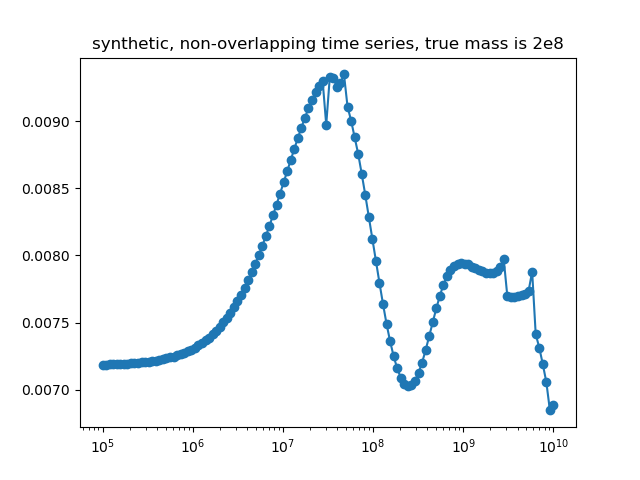

## Synthetic non-overlapping light curves, 2

This experiment is coded in this [folder](Synthetics/Experiment4/).

The purpose of this numerical experiment is to see whether it is theoretically possible to recover the mass parameter for a set of lightcurves that do not overlap in time.

This experiment is identical to this [experiment](Syntheticnonoverlapping1.md), but there are more data per lightcurve (50 observations).
One more difference, is that number of restarts in the optimisation was set to 3 (previously it was 1).

Note that altough all conditions remain identical to those of the previous experiment (including the random seed), the lightcurves may look different because of ther order in which the observations are sampled. Hence by increasing the number of simulated observations, we  inadvertedly change the order in which the observations are sampled.

This is a figure of the synthetically generated light curves:

This is the inferred posterior mass:

