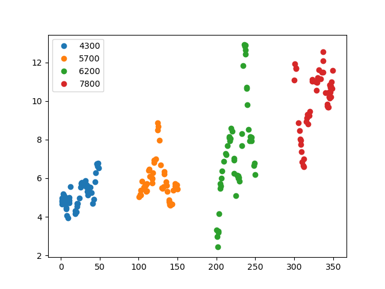
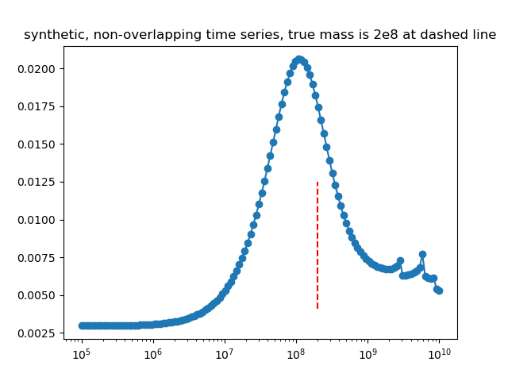

## Synthetic non-overlapping light curves, 3

This experiment is coded in this [folder](ConvolvedGaussianProcessesExperiments/Synthetics/Experiment6/).

The purpose of this numerical experiment is to see whether it is theoretically possible to recover the mass parameter for a set of lightcurves that do not overlap in time.

This experiment is similar to the other ones. Here, however, we have 4 lightcurves that are further separated. On average there is one observation per unit time.

This is a figure of the synthetically generated light curves:

This is the inferred posterior mass:

