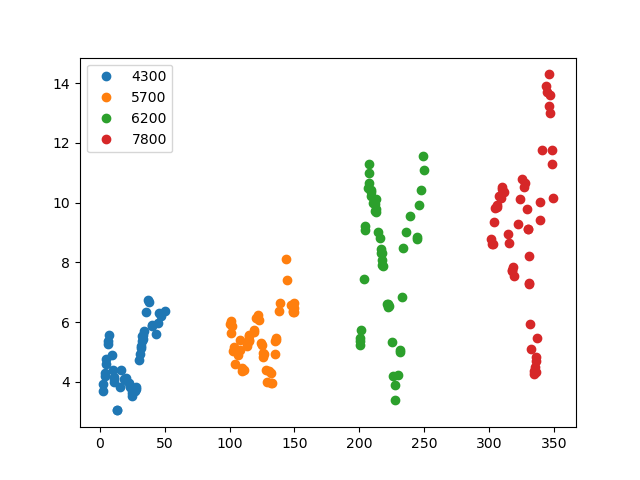
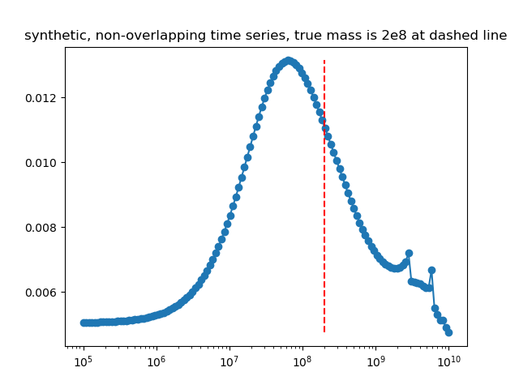
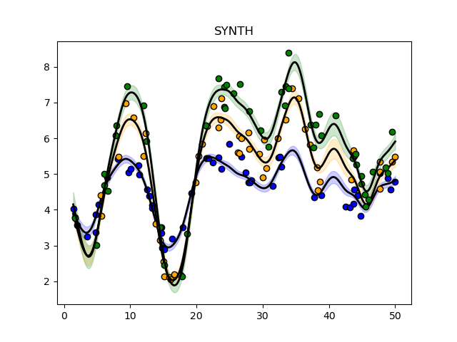

## Synthetic non-overlapping light curves, 4

This experiment is coded in this [folder](Synthetics/Experiment7/).

The purpose of this numerical experiment is to see whether it is theoretically possible to recover the mass parameter for a set of lightcurves that do not overlap in time.

This experiment is identical to this [one](Syntheticnonoverlapping3.md) the only single difference being that a different random seed is used for generating the synthetic data.

This is a figure of the synthetically generated light curves:

This is the inferred posterior mass:

This is the fit for the most likely mass:

